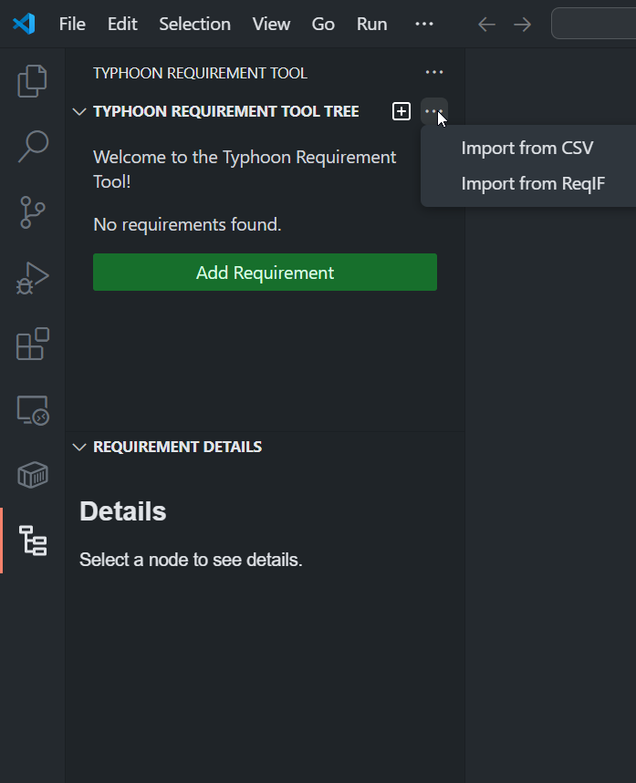
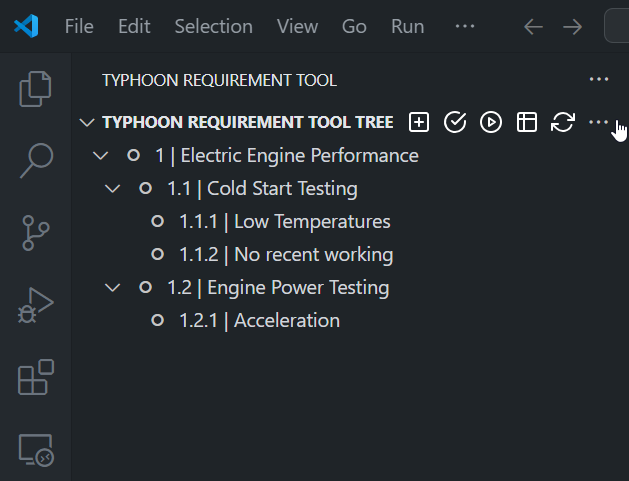
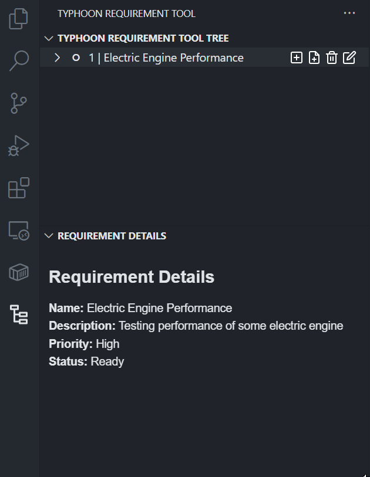
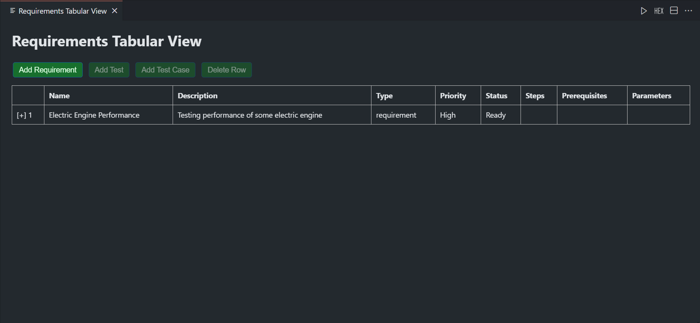
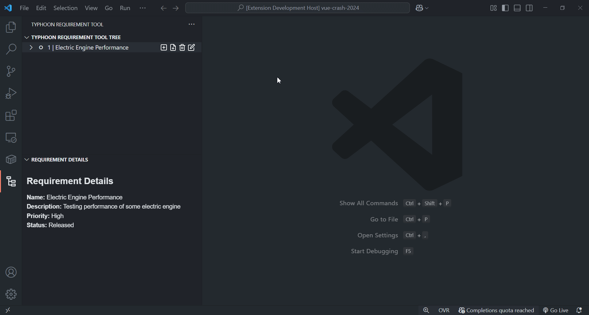
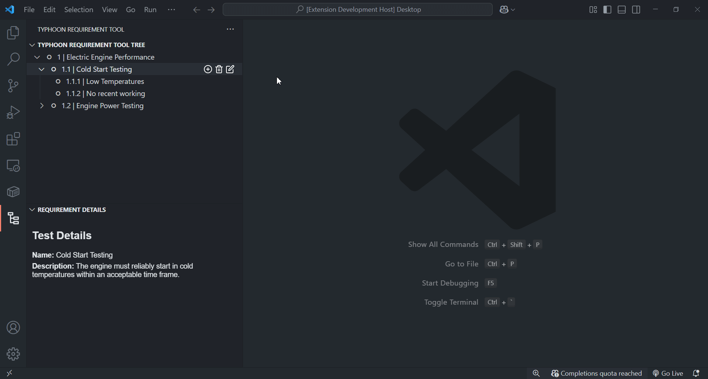
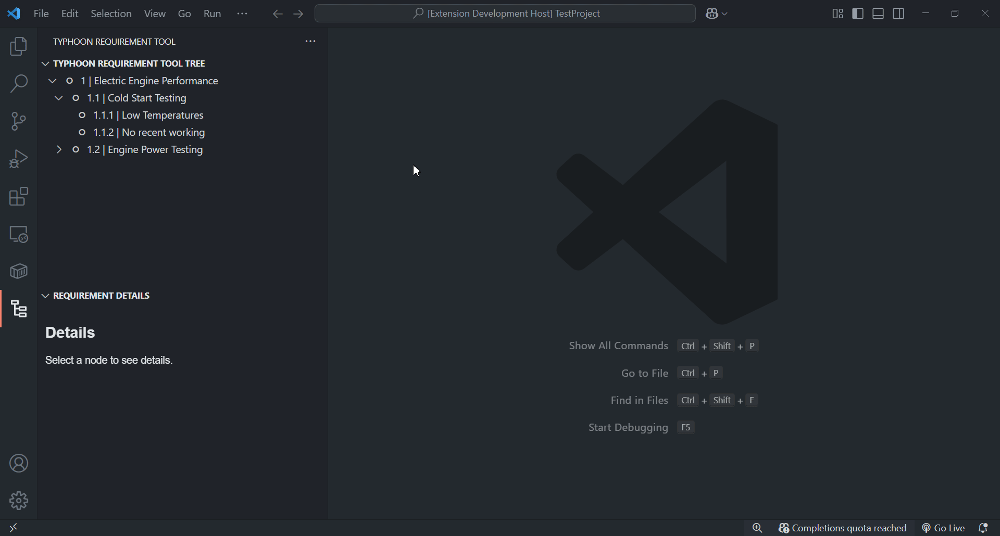
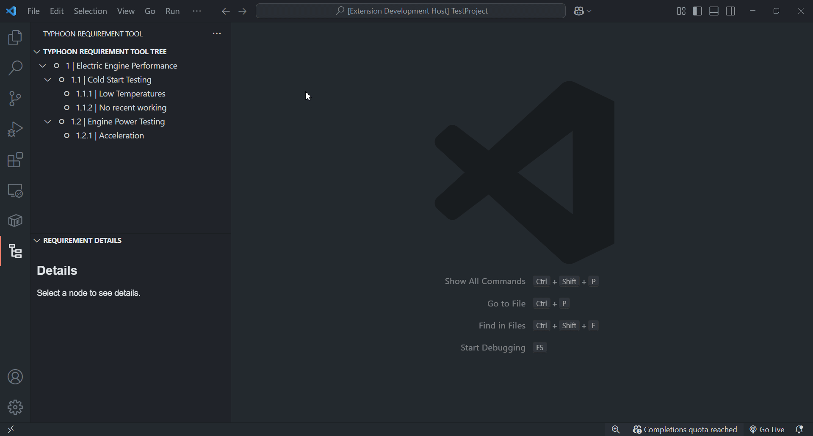

# Typhoon Requirement Tool VS Code Extension

The **Typhoon Requirement Tool** is a Visual Studio Code extension designed to streamline requirement specification, test management, and automated test code generation for Python projects using pytest. It provides an intuitive interface for managing requirements, tests, and test cases, and integrates with ReqIF and CSV formats for import/export. The extension also offers advanced coverage checking and conflict resolution features.

---

## Table of Contents

- [Features Overview](#features-overview)
- [Getting Started](#getting-started)
- [Managing Requirements, Tests, and Test Cases](#managing-requirements-tests-and-test-cases)
  - [Tree View](#tree-view)
  - [Details View](#details-view)
  - [Tabular View](#tabular-view)
- [Editing and Deleting Items](#editing-and-deleting-items)
- [Importing and Exporting Data](#importing-and-exporting-data)
  - [ReqIF Format](#reqif-format)
  - [CSV Format](#csv-format)
- [Generating Test Code](#generating-test-code)
- [Coverage Check and Conflict Resolution](#coverage-check-and-conflict-resolution)
- [Example Workflow](#example-workflow)
- [FAQ](#faq)
- [Support](#support)

---

## Features Overview

- **Hierarchical Requirement Management**: Organize requirements, tests, and test cases in a tree structure.
- **Rich Editing**: Add, edit, and delete requirements, tests, and test cases with detailed forms.
- **Import/Export**: Seamless integration with ReqIF and CSV formats.
- **Automated Test Generation**: Generate pytest-compatible test code from requirements.
- **Coverage Analysis**: Visualize coverage gaps and resolve conflicts interactively.
- **Multiple Views**: Switch between Tree, Details, and Tabular views for flexible management.

> 
>
> *Screenshot: Tree View and Details View when extension opens.

---

## Getting Started

1. **Install the Extension**  
   Download and install the Typhoon Requirement Tool from the VS Code Marketplace.

2. **Open the Extension**  
   Open the "Typhoon Requirement Tool" view from the Activity Bar.

3. **Initialize a Project**  
   Start by adding your first requirement using the context menu or the command palette.

> 
> *Animated GIF: Installation and opening the extension.*

---

## Managing Requirements, Tests, and Test Cases

### Tree View

The Tree View displays your requirements hierarchy. Next to nodes are buttons to add, edit or delete requirement or test or test case.

- **Requirement**: Represents a functional or non-functional requirement.
- **Test**: Linked to a requirement, represents a test file.
- **Test Case**: Linked to a test, represents an individual test scenario or test function.

> 
>
> *Screenshot: Tree View with context menu open.*

### Details View

Selecting a node in the Tree View displays its details in the Details View, including all properties and parameters.

> 
>
> *Gif: Details View showing a requirements details when selected.*

### Tabular View

Switch to the Tabular View for a spreadsheet-like interface, allowing adding/editing/deleting and quick overview of all items.

> 
>
> *Screenshot: Tabular View.*

---

## Editing and Deleting Items

- **Edit**: Use the pencil icon or context menu to edit any requirement, test, or test case.  
  *Example: Editing a test case updates its scenario, steps, prerequisites, and parameters.*

- **Delete**: Use the trash icon or context menu to remove items. Deleting a requirement removes all its children.

> 
>
> *Short video: Editing and deleting a requirement and its children.*

---

## Importing and Exporting Data

### ReqIF Format

- **Import**: Use the command palette or context menu to import requirements from a ReqIF file.
- **Export**: Export your current requirements tree to ReqIF for use in other tools.
> Reqif file structure supports Reqif Studio format.

### CSV Format

- **Import**: Import requirements from a CSV file (supports ReqView-compatible format).
- **Export**: Export requirements to CSV for reporting or further editing.

> 
>
> *Short video: Import and Export to reqif/csv.*

---

## Generating Test Code

Generate pytest-compatible test code directly from your requirements tree:

1. Click **Generate Tests** in the view title bar or use the command palette.
2. Select the output folder.
3. The extension generates Python test files based on your requirements and test cases.

> 
>
> *Short demo: Generating tests and viewing the output files.*

---

## Coverage Check and Conflict Resolution

The Coverage Check feature compares your requirements and tests with the existing test project:

- **Visual Coverage Report**: See missing, extra, and modified requirements/tests/test cases.
- **Interactive Conflict Resolution**: Resolve differences directly from the coverage report webview.
- **Node Highlighting**: Tree nodes are color-coded based on coverage status (e.g., missing, modified, skipped).
- **Ignore file**: User can define .typhoonignore (same as .gitignore) file where he can write what files to ignore when he run coverage check.
  

> 
>
> *Short demo: Resolving conflicts with test project.*

---

## Example Workflow

1. **Define Requirements**: Add requirements and organize them hierarchically.
2. **Add Tests and Test Cases**: For each requirement, add tests and detailed test cases.
3. **Import/Export**: Exchange data with ReqIF/CSV as needed.
4. **Generate Tests**: Produce pytest code for your project.
5. **Run Coverage Check**: Compare your requirements with the test project and resolve any conflicts.

---

## Support

For issues, feature requests, or contributions, please visit the [GitHub repository](https://github.com/your-repo/typhoon-requirement-tool) or contact the maintainer.

---
